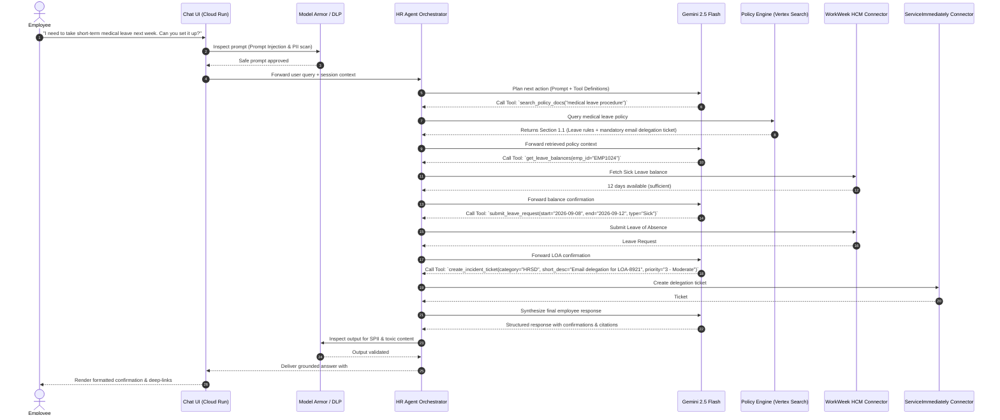
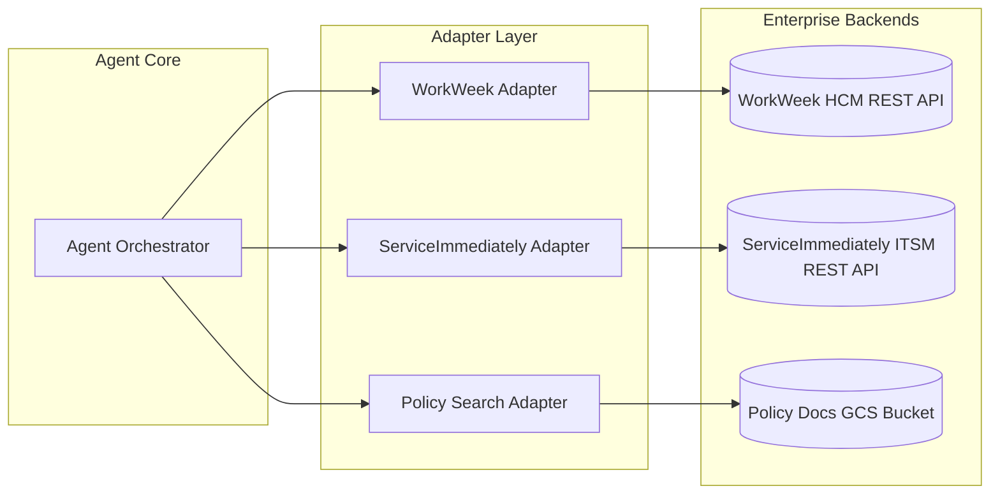
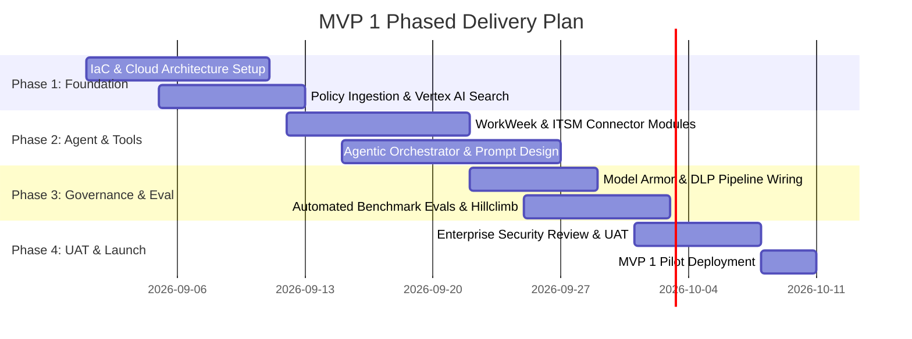

# Enterprise Agentic Solution Design Document - MVP 1

**Project:** HR Agentic Virtual Assistant  
**Based on BRD:** [HR Agentic Solution BRD (MVP 1)](https://docs.google.com/document/d/1B46ERMVZapwSN8RPmsJ0_NnayuUkaTT6ZcujgwdjTX8/edit?resourcekey=0-kwi-DdO3wHIdEk8gtbpeQQ&tab=t.tpcr3esq94y#heading=h.imkwl950mppq)  
**Template Reference:** [Enterprise Agentic SDD Template](https://docs.google.com/document/d/1NYfcSjLFjoLLwB94wuRIUL8n1NumhXPKIc77zpYNYUU/edit?tab=t.0#heading=h.r6zy0naegc3w)

---

## Document Control

#### Document Metadata

| Field | Value |
| :---- | :---- |
| **Author(s)** | Google Cloud Solutions Architecture & CE Team |
| **Date** | September 2026 |
| **Status** | Approved / Ready for MVP 1 Implementation |
| **Target Audience** | Enterprise Architecture, HR Engineering, SRE, Infosec & Cloud Leadership |

#### Revision History

| Version | Date | Author | Description of Change |
| :---- | :---- | :---- | :---- |
| 0.1 | September 2026 | Cloud Architect | Initial outline based on BRD and instructor template |
| 1.0 | September 2026 | Cloud Architect | Full technical design covering architecture, flows, security, and FinOps |
| 1.1 | September 2026 | Cloud Architect | Expanded Section 4 (Auth boundaries, VPC-SC, RBAC, SPII lifecycle) and Section 5 (3rd-party integration protocols for WorkWeek, ServiceImmediately, and Policy Repo) |

---

### 1. Executive Summary & Scope Boundaries

#### 1.1. Business Overview & Context

Enterprise employees currently experience high friction and delay when navigating disparate internal HR systems for routine inquiries and transactions. HR and IT helpdesks are overwhelmed with Tier-1 queries regarding leave balances, policy clauses, expense rules, and basic support tickets.

The **HR Agentic Solution (MVP 1)** introduces an AI-driven, multi-system conversational agent that:

1. **Deflects $\\ge 40%$ of Tier-1 Inquiries** within 6 months via grounded policy search.  
2. **Streamlines Self-Service Transactions** in HCM (**WorkWeek**) and ITSM (**ServiceImmediately**).  
3. **Executes Cross-System Workflows** (e.g. Policy Validation $\\rightarrow$ Leave Booking in WorkWeek $\\rightarrow$ Out-of-Office Ticket in ServiceImmediately).  
4. **Guarantees Zero-Trust AI Safety & Governance** with strict origin verification, SPII redaction, and bounded tool execution.

#### 1.2. Scope Boundaries

| Dimension | In-Scope (MVP 1) | Out-of-Scope (Future / MVP 2) |
| :---- | :---- | :---- |
| **User Interface** | Web-based chat client hosted on Cloud Run. | Voice interfaces, WhatsApp, native mobile apps. |
| **Knowledge Domain** | Static approved HR policy documents (Leave, Travel/Expense, Code of Conduct). | Real-time policy document editing, dynamic intranet scraping. |
| **WorkWeek (HCM)** | Read Profile, Query PTO balances, Update contact info, Submit time-off. | Payroll processing, salary/compensation changes, performance reviews. |
| **ServiceImmediately (ITSM)** | Query ticket status/timeline, Create incident, Append comments, Update status to Resolved. | Change management, hardware asset provisioning, SLA penalty calculations. |
| **Tenancy & Auth** | Single-tenant environment using functional service credentials. | Multi-tenancy, full Enterprise SSO/Okta integration. |
| **Languages** | English (en-US / en-SG). | Multi-lingual localization. |

#### 1.3. Target Architecture Overview

```mermaid
graph TD
    User([Enterprise Employee]) <--> CDN[Cloud CDN & Cloud Armor WAF]
    CDN <--> LB[External HTTPS Cloud Load Balancer]
    LB <--> Frontend[Chat Web App<br/><b>Cloud Run</b>]
    
    subgraph Security & Guardrail Boundary
        Frontend <--> GuardrailProxy[Safety & Redaction Proxy<br/><b>Model Armor + Cloud DLP / Sensitive Data Protection</b>]
    end
    
    subgraph Agentic Orchestration Layer
        GuardrailProxy <--> Orchestrator[Agent Orchestrator Service<br/><b>ADK / LangGraph on Cloud Run</b>]
        Orchestrator <--> LLM[Foundation Model<br/><b>Gemini 2.5 Flash / Pro (Vertex AI)</b>]
        Orchestrator <--> Cache[(Session Memory & Rate Limits<br/><b>Cloud Memorystore Redis</b>)]
    end
    
    subgraph Tool & Enterprise Data Connectors
        Orchestrator <--> PolicyTool[Policy Retrieval Service<br/><b>Vertex AI Search / Vector Search</b>]
        PolicyTool <--> GCS[(Policy Documents Bucket<br/><b>Cloud Storage</b>)]
        
        Orchestrator <--> WorkWeekTool[WorkWeek Connector<br/><b>Cloud Functions / IAM Auth</b>]
        WorkWeekTool <--> WW_API[(WorkWeek HCM REST API)]
        
        Orchestrator <--> ITSMTool[ServiceImmediately Connector<br/><b>Cloud Functions / Secret Manager</b>]
        ITSMTool <--> SI_API[(ServiceImmediately REST API)]
    end
    
    subgraph Observability & Audit
        Orchestrator --> Trace[Cloud Trace]
        Orchestrator --> Logging[Cloud Logging]
        Logging --> BQ[(Audit & Analytics Lake<br/><b>BigQuery</b>)]
    end
```

#### 1.4. Alternatives Considered

| Decision Area | Selected Option | Alternative Considered | Trade-offs & Selection Rationale |
| :---- | :---- | :---- | :---- |
| **Agent Hosting Platform** | **Cloud Run (Containerized ADK/LangGraph)** | Vertex AI Reasoning Engine (Managed) | Cloud Run provides complete control over container networking, custom VPC connectors, and deterministic execution guards required by enterprise Infosec. |
| **Foundation Model** | **Gemini 2.5 Flash** (with fallback to **Gemini 2.5 Pro**) | Open-Source LLMs (e.g. Llama 3 on GKE) | Gemini 2.5 Flash delivers sub-second latency, native tool calling, low cost, and strict schema obedience without GPU infrastructure overhead. |
| **Policy Search Engine** | **Vertex AI Search (GCS Data Store)** | Self-hosted Pinecone / Milvus | Vertex AI Search offers turnkey managed chunking, semantic search, out-of-the-box metadata filtering, and native Google deep-linking. |
| **SPII Redaction** | **Cloud Sensitive Data Protection (DLP)** | Custom Regex / Local NER | Cloud DLP provides enterprise-certified infoType detectors (passports, SSNs, phone numbers, addresses) with $<150\\text{ ms}$ processing latency. |

---

### 2. Production-Ready Future State Design

While MVP 1 is scoped to functional testing and single-tenant execution, the production roadmap envisions:

1. **Multi-Tenant Enterprise Isolation:** Partitioned database namespaces in Cloud Spanner and dynamic IAM role assumptions per tenant.  
2. **Enterprise Identity Federation:** Direct SAML 2.0 / OIDC integration with Okta, Azure AD, and Google Workspace, passing down-scoped OAuth2 bearer tokens to WorkWeek and ServiceNow.  
3. **Multi-Agent Specialist Swarms:** Decomposing the orchestrator into domain-specific subagents (e.g., *BenefitsSpecialist*, *TravelExpenseAuditor*, *ITSMDispatcher*) supervised by a master triage planner.  
4. **Continuous Learning & Dynamic Evals:** Continuous automated evaluation against held-out golden datasets using Cloud Build and automated LLM-as-a-judge pipelines.

---

### 3. System Flows, Sequence Diagrams & Agent Design

#### 3.1. Cross-System Orchestration Flow (`UC-2.2`: Medical Leave & Delegation)



---

### 4. Security, Governance & Identity

#### 4.1. Authentication Boundaries & Delegated Auth

The system enforces strict multi-boundary authentication across the entire interaction chain:

1. **User-to-Frontend Boundary:** Authenticated via Cloud Identity-Aware Proxy (IAP) or session bearer tokens, establishing the caller's validated identity (`employee_id: EMP1024`).  
2. **Frontend-to-Orchestrator Boundary:** Internal service-to-service communication authenticated using Google OIDC Service Account identity tokens over private VPC routing.  
3. **Agent-to-Backend Tool Boundary (`FR-1.2`, `FR-3.1`):** All downstream API calls to WorkWeek and ServiceImmediately pass a **composite authentication context** containing:  
   * The caller's down-scoped employee token (limiting data access strictly to their own record).  
   * An immutable automation origin header: `X-Origin: Altostrat-HR-Agent-MVP1` to distinguish automated self-service transactions from manual back-office administrative actions in audit logs.

#### 4.2. Network Isolation & Perimeter Security

* **VPC Service Controls (VPC-SC):** A secure service perimeter encompasses Vertex AI, Cloud Run, Cloud Storage, and Secret Manager, preventing data exfiltration to unauthorized Google Cloud projects.  
* **Private Google Access & Serverless VPC Connector:** The Cloud Run orchestrator and connector functions route all traffic through a dedicated VPC subnet (`10.8.0.0/28`) without assigning public IP addresses.  
* **Edge Defense (Cloud Armor):** External HTTPS Load Balancer enforces WAF rate-limiting, geo-fencing (Singapore & Global corporate IPs), and OWASP Top 10 web injection filtering.

#### 4.3. Role-Based Access Control (RBAC) & Identity Management (`FR-1.5`)

* **Tenant & Employee Data Scoping:** The agent strictly validates that the `employee_id` in tool parameters matches the authenticated session identity. Cross-user queries (e.g. attempting to read another employee's PTO balance or address) are blocked at the orchestrator layer before calling backend APIs.  
* **Role Hierarchies:**  
  * **Standard Employee:** Read own profile/PTO, submit own leave, create own support tickets.  
  * **Direct Manager:** View direct report leave notifications (read-only); approve/deny leave workflows in WorkWeek.  
  * **HR / IT Administrator:** System configuration, knowledge base sync, and audit analytics access.  
* **Least Privilege IAM:** The Agent Service Account (`sa-hr-agent@project.iam.gserviceaccount.com`) is granted only `roles/secretmanager.secretAccessor` (scoped to specific secrets) and `roles/aiplatform.user`.

#### 4.4. Sensitive Data Handling & SPII Lifecycle (`FR-1.4`, `FR-3.4`)

* **Cloud Sensitive Data Protection (DLP) Pipeline:** Real-time inspection templates scan conversation turns for sensitive identifiers (NRIC, FIN, Passport numbers, personal phone numbers, physical addresses). Detected entities are masked using cryptographic pseudonymization/tokenization (e.g. `[REDACTED_PHONE]`) before payloads are written to Cloud Logging or BigQuery.  
* **Zero-Dynamic Caching in AI Layer (`FR-3.4`):** Dynamic employee PII and leave balance data fetched from WorkWeek is treated as ephemeral session state. It is never cached in persistent vector stores or used in foundation model fine-tuning.  
* **Retention Policy:** Conversation transcripts in BigQuery are partitioned by date with a strict 90-day time-to-live (TTL) expiration.

#### 4.5. AI Safety, Model Armor & Guardrails (`FR-1.3`, `NFR-1.1`)

* **Model Armor Pre-Execution Filter:** Intercepts incoming user prompts for jailbreak attempts, indirect prompt injection (e.g. hidden malicious instructions in documents), and prompt leakage attacks with $<150\\text{ ms}$ latency overhead.  
* **Domain Containment Guard:** Rejects out-of-scope non-HR tasks (e.g. asking the agent to write code, solve math riddles, or engage in non-work discussions).  
* **Strict Grounding Gate:** If retrieved policy chunk similarity scores fall below confidence threshold ($0.65$), the model is constrained by system prompts to refuse rather than extrapolate plausible policies.

---

### 5. Integration Details & Error Handling

#### 5.1. Third-Party Tool Integration Methodology & Protocols

The HR Agent integrates with three core backend enterprise systems using standardized REST/JSON APIs, secured via Mutual TLS, Bearer token authentication, and the Gateway/Adapter design pattern.



##### 5.1.1. WorkWeek (HCM) API Integration (`FR-3.1` - `FR-3.4`)

* **Protocol & Format:** RESTful HTTPS, JSON request/response bodies.  
* **Auth:** Bearer OAuth2 Token retrieved dynamically from Secret Manager + User Delegation Header.  
* **Key Endpoints & Operations:**  
  * `GET /api/v1/employees/{employee_id}` — Fetches profile metadata (department, role, manager, hire date, address, phone).  
  * `GET /api/v1/timeoff/balances?employee_id={id}` — Returns accrued, used, and remaining balances for `Vacation` and `Sick` leave.  
  * `POST /api/v1/timeoff/requests` — Submits a time-off request with payload `{"employee_id", "leave_type", "start_date", "end_date", "days"}`.  
  * `PATCH /api/v1/employees/{employee_id}/contact` — Updates personal address and phone number in employee record.

##### 5.1.2. ServiceImmediately (ITSM / HRSD) API Integration (`FR-4.1` - `FR-4.3`)

* **Protocol & Format:** ServiceImmediately Table REST API (`/api/now/table/...`).  
* **Auth:** Basic/OAuth Auth token with `X-Origin: Altostrat-HR-Agent-MVP1` audit header.  
* **Key Endpoints & Operations:**  
  * `GET /api/now/table/incident/{ticket_id}` — Retrieves ticket state, priority, category, assignee, and work notes timeline.  
  * `POST /api/now/table/incident` — Creates support ticket specifying `caller_id`, `category` (e.g. 'HRSD', 'IT'), `short_description`, and `priority` ('1 - Critical', '2 - High', '3 - Moderate', '4 - Low').  
  * `POST /api/now/table/incident/{ticket_id}/comments` — Appends user or agent update notes to activity timeline.  
  * `PATCH /api/now/table/incident/{ticket_id}` — Transitions ticket lifecycle state (e.g. to `state: 6` [Resolved] with `close_notes`).

##### 5.1.3. Centralized Policy Document Repository (`FR-5.1` - `FR-5.5`)

* **Protocol:** Cloud Storage REST API + Vertex AI Search Ingestion Connector.  
* **Sync Architecture:** Policy documents stored in `gs://altostrat-hr-policies/` are parsed into chunked representations ($500\\text{ tokens}$ with $100\\text{ token}$ overlap). Embeddings are updated within 1 hour of file modification.

---

#### 5.2. Integration Operational Guardrails & Business Constraints

The system applies programmatic validation logic before dispatching external tool calls:

| Target System | Guardrail Rule | Technical Implementation | BRD Ref |
| :---- | :---- | :---- | :---- |
| **WorkWeek** | **Balance Enforcement** | Pre-flight validation verifying requested days $\\le$ remaining accrued balance. | `FR-3.3` |
| **WorkWeek** | **Temporal Validity** | Validates $start\_date \\ge today$ and $start\_date \\le end\_date$; blocks inverted/past dates. | `FR-3.3` |
| **WorkWeek** | **Format Restrictions** | Regex validation for E.164 phone formats and structured address schema. | `FR-3.3` |
| **ServiceImmediately** | **Lifecycle Transition Constraints** | Enforces valid state machine paths (blocks invalid transitions, e.g. `New` $\\rightarrow$ `Closed` directly). | `FR-4.3` |
| **ServiceImmediately** | **Duplicate Ticket Mitigation** | Scans ticket index for identical category/description submitted by the user in the last 15 minutes. | `FR-4.3` |
| **ServiceImmediately** | **Priority Verification** | Validates that '1 - Critical' priority tags meet documented operational outage criteria. | `FR-4.3` |

---

#### 5.3. Fault Mapping, Custom Fallback Logic & User Notifications (`NFR-4.1` - `NFR-4.3`)

| Failure Scenario | Root Cause | System Resilience Action | User-Facing Notification Template |
| :---- | :---- | :---- | :---- |
| **WorkWeek / ITSM 503 / Timeout** | Transient backend outage or network blip | Retry 3x with exponential backoff ($1\\text{s}, 2\\text{s}, 4\\text{s}$). If exhausted, trip circuit breaker. | *"I am temporarily unable to connect to WorkWeek/ServiceImmediately. Your request was not submitted. Please try again in a few minutes."* |
| **WorkWeek 422 Insufficient Balance** | Requested leave exceeds remaining accrued balance | Intercept error, extract deficit amount, format available balance summary. | *"You currently have 3 days of accrued vacation remaining, but requested 5 days. Would you like to submit a request for 3 days instead?"* |
| **Cross-System Partial Failure (`UC-2.x`)** | Step 1 (WorkWeek LOA) succeeds, Step 2 (ITSM ticket) fails | Log partial transaction ID in BigQuery audit table; initiate compensation alert. | *"Your Leave of Absence (#LOA-8921) was successfully submitted in WorkWeek. However, your email delegation ticket could not be created. Please share #LOA-8921 with your manager for manual setup."* |
| **Policy Search 0-Result / Low Score** | Query topic not present in Altostrat handbook | Suppress model hallucination via Grounding Gate; log gap to BigQuery eval table. | *"I looked through the Altostrat Singapore Employee Policy Handbook, but there is no policy on file regarding this topic. Please contact your HR Business Partner."* |
| **Rate Limit / 429 Too Many Requests** | API throttling threshold reached | Queue request in Cloud Tasks with jittered retry. | *"Our service is experiencing high request volume. Processing your update, please wait a moment..."* |

---

### 6. Cost Estimation & FinOps (Monthly Projections)

*Based on an enterprise pilot of 2,000 employees (\~15,000 conversational interactions / month).*

| Component | Sizing / Usage Volume | Estimated Monthly Cost (USD) |
| :---- | :---- | :---- |
| **Cloud Run (Frontend + Agent Orchestrator)** | 4 vCPU, 8 GB RAM (Auto-scale 1-10 instances) | \~$85.00 |
| **Vertex AI - Gemini 2.5 Flash** | 15k turns × 2k input tokens + 300 output tokens | \~$22.50 |
| **Vertex AI Search (Document Store)** | Indexing 150 policy concepts + 15k search queries | \~$150.00 |
| **Cloud DLP / Model Armor** | Inspection of \~10 MB text/month | \~$20.00 |
| **Cloud Memorystore (Redis)** | Basic Tier 1 GB instance | \~$35.00 |
| **Cloud Logging, Trace & BigQuery** | \~20 GB log volume | \~$12.00 |
| **Total Estimated MVP 1 Operating Cost** | — | **\~$324.50 / month** |

---

### 7. Deployment & Delivery Plan

#### 7.1. Infrastructure as Code (IaC) & Pipeline

* **Terraform Modules:** Declarative provisioning of Cloud Run services, Secret Manager secrets, IAM service accounts, and VPC Connector.  
* **CI/CD Pipeline (Cloud Build):**  
  1. Unit tests & linting (`pytest`, `flake8`).  
  2. Hermetic evaluation suite execution (`evals/run_eval.py --mode okf --judge on`).  
  3. Container image build and push to **Artifact Registry**.  
  4. Blue/Green deployment to **Cloud Run** staging and production services.

#### 7.2. Phased Delivery Milestones



---

### 8. Assumptions, Constraints, Risks & Mitigations

| Category | Description | Impact | Mitigation Strategy |
| :---- | :---- | :---- | :---- |
| **Constraint** | Functional mock credentials used for MVP 1. | High | Scope testing strictly to synthetic test employees; isolate database environments. |
| **Risk: LLM Hallucination** | Agent inventing ungrounded leave policies. | Critical | Enforce strict Grounding Gate: zero ungrounded claims, mandatory citations, cap ungrounded scores at 40%. |
| **Risk: Prompt Injection** | Malicious users overriding policy limits. | High | Pre-execution safety filter using Model Armor + deterministic rule-based parameter validation. |
| **Assumption** | Policy documents remain static during MVP 1. | Medium | Scheduled sync pipeline to re-index documents whenever updated in source repo. |

---

### 9. Quality Evaluation & UAT Framework

#### 9.1. Quantitative Evaluation Suite

The solution incorporates a two-layer evaluation architecture:

2. **Deterministic Floor Grader (`--judge off`):** Verifies keyword presence, refusal triggers, and format syntax across all 13 test cases in $<5\\text{ seconds}$.  
3. **LLM-as-a-Judge Rubric Grader (`--judge on`):** Evaluates 5 weighted dimensions on a 0-2 scale:  
   * **Correctness (weight 3):** All facts accurate.  
   * **Grounding (weight 3):** Derived 100% from retrieved context.  
   * **Reasoning (weight 3):** Identifies prohibitions, seniorities, and gotchas.  
   * **Abstention (weight 2):** Refuses out-of-scope/ungrounded queries.  
   * **Citation (weight 1):** Valid handbook section citations.

#### 9.2. Acceptance Bar

* $\\ge 95%$ overall score on the benchmark test suite.  
* $100%$ pass on the Hard Cases Badge (`host_gift_card_gotcha`, `room_salon_gotcha`, `pet_bereavement_distractor`, `group_meal_seniority_trap`, `unpaid_personal_leave_multihop`, `aged_expense_approval_level`, `shared_parental_leave_father_deduction`, `remote_confidential_public_place`, `out_of_domain`, `ungrounded_policy`).  
* $0%$ hallucination rate on policy Q&A.

---

### 10. Open Questions & Design Decisions

| ID | Open Decision / Question | Owner | Target Resolution Date | Status |
| :---- | :---- | :---- | :---- | :---- |
| **DQ-1** | Will WorkWeek provide webhook notifications for async leave approvals? | HR Systems Lead | 2026-09-15 | In Review |
| **DQ-2** | Confirm production SLA latency targets during peak HR benefit renewal cycles. | SRE Lead | 2026-09-18 | Pending |
| **DQ-3** | Finalize Singapore MSF statutory leave clawback protocol for dual-employee claims. | Legal & HR Policy Lead | 2026-09-20 | In Review |

